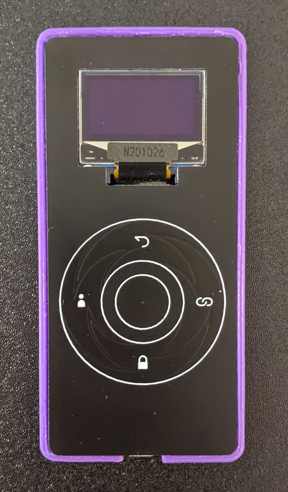

# 密码账簿
一种 DIY 离线密码管理器设备

## 动机
这个 DIY 项目的核心是一个密码管理设备。
它适合以下人群：
- 不喜欢在浏览器里保存密码的人
- 经常要使用公共电脑或者经常换电脑或重装系统的人
- 由于工作原因，每隔一段时间就必须要换密码的人。
- 密码超级长，或者需要使用长密钥（比如 github key 或者 SSH key）的人。
- 入门 CircuitPython 开发或者，纯心想折腾一下的人。

***免责声明**：
本项目仅包含离线的单片机代码和静态前端网页，并没有任何后端服务，
所以本项目并不会在网络上存储或转发您的密码数据。
这个项目把使用体验放在第一位，
换句话说使用这个项目并不能让你的密码更安全。
如果您因为使用本项目中的代码而导致重要的账户或数据丢失或者泄露，
本项目的作者不承担责任。
如果您使用了本项目中的代码，
就等同于认可了本声明，
并全面了解代码的实际运作方式，
且意承担全部风险。*

## 基于的技术
硬件和硬件模块
- Pi Pico
- I2C SSD1306 OLED 显示器

语言和库
- CircuitPython 7.0.0
    - displayio
    - usb_hid
    - touchio
- JavaScript
    - Chrome File API
    - Ace Editor

技术
- 有限状态机
- 维吉尼亚加密

## 其他资源
- 请在以下网址查看电路设计和PCB: https://oshwlab.com/urfdvw/password-keeper_copy_copy

## 如何制作
- PCB 打样后并焊接元件。
- 在 Pi Pico 上安装 CircuitPython。
- 将本 repository 中的代码拷贝到 CIRCUITPY 磁盘中。
    - 这时会报错，因为还没有加载密码数据。
    - 关于如何加载密码数据到单片机，请查看本文档后续的部分。
- 将本 repository 中的后盖 3D 模型打印出来，并用热熔胶粘接到 PCB 后面。

## 如何使用

### 如果你是新用户
- 制作一个**密码账簿**
- 在浏览器中打开网页 [Password Keeper Manager](https://urfdvw.github.io/Password-Keeper/)
- 在 `master password` 处输入主密钥
- 在 `Deciphered Text` 处按提示顺序和 csv 的格式，输入你想保存的账户信息。
- 点击界面中的 [Save As] 按键下载密码数据文件，其文件名为 `items.csv`。该文件是加密过的文件。
- 用 USB 线将密码账簿设备链接到电脑，然后将刚下载的 `items.csv` 文件保存到 `CIRCUITPY` 磁盘中。

### 如何使用**密码账簿**设备
- 用 USB 线将密码账簿设备链接到电脑
- 在密码账簿设备上输入主密钥
    - 旋转转盘切换字母
    - 右键输入新的字符
    - 左键删除最后一个字符
    - 中键确认密钥
- 在列表中找到需要的账户名
    - 旋转转盘以寻找账户
    - 中键进入账户
    - 上键回到密钥输入界面
- 在账户界面下
    - 右键输入网址
    - 左键输入用户名
    - 下键输入密码
    - 上键返回到账户列表

### 更新密码数据
- 用 USB 线将密码账簿设备链接到电脑
- 在浏览器中打开网页 [Password Keeper Manager](https://urfdvw.github.io/Password-Keeper/)
- 在 `master password` 处输入主密钥
- 点击界面中的 [Open] 按键，选择 `CIRCUITPY` 磁盘中的 `items.csv` 文件
    - 密码数据会显示在 `Deciphered Text` 区域
    - 如果主密钥输入错误， 那么显示出来的数据会是错误的数据。
- 在 `Deciphered Text` 区域增加或者修改密码数据。
- 如果您需要，也可以点击 [Random Password] 按键，这样会在光标处输入一段纯随机的强密码。
- 点击界面中的 [Save] 按键，所有的修改会被保存。
- ***注意：强烈建议您将 `items.csv` 备份在安全的地方。*** 

### 修改主密钥
- 在 [Password Keeper Manager](https://urfdvw.github.io/Password-Keeper/) 中，用原有的主密钥打开`items.csv`。
- 请确认 `Deciphered Text` 区域中的密码是正确的。
- 修改 `master password` 区域中的主密码
- 点击界面中的 [Save] 以保存修改

## 如何扩展本项目
软件扩展
- 您可以设计自己的小程序，并放在菜单中

硬件扩展
- 您可以将转盘的设计用于其他类似的项目中

---
# Happy Coding
